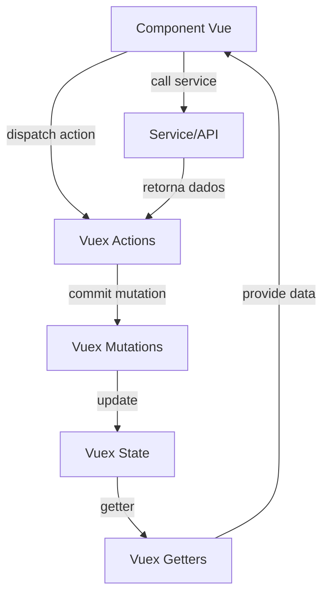

# Arquitetura Vue.js

Este documento descreve uma arquitetura padrão para projetos utilizando Vue.js, com foco em integração em aplicações Java/JSP.

## Diagrama do fluxo entre Component Vue e Vuex Store


## 1. Integração Vue.js em projetos JSP

Para iniciar uma feature Vue.js em um projeto Java/JSP, crie um arquivo `.jsp` dedicado para ser o bootstrap da aplicação Vue. Exemplo:

## Exemplo de Inicialização do Vue no JSP

```jsp
<%@include file="../cabecalho.jsp" %>
<%
    String ANUNCIOS_VUE_IMPORT = "/clinicweb/assets/js/dist/anuncios.js";
    String myEnv = Util.getEnv("MY_ENV");

    if (myEnv != null && myEnv.equals("development")) {
        ANUNCIOS_VUE_IMPORT = Util.getEnv("LOCALHOST_VUE_URL") + ANUNCIOS_VUE_IMPORT;
    }


%>
<!DOCTYPE html>
<html>
    <head>
        <%@include file="../head.jsp" %>
        <script type="text/javascript" src="../js/jscolor/jscolor.js"></script>
    </head>
    <body>
        <div id="wrap">
            <%@include file="header.jsp" %>
            <div id="mainContent">
              <div id="anuncios"></div>
            </div>
        </div>
        <%@include file="footer.jsp" %>
    </body>
    <script type="text/javascript" src="<%= ANUNCIOS_VUE_IMPORT %>"></script>
</html>

```


### Exemplo: `main.js` do módulo

```js
import Vue from 'vue';
import Vuex from 'vuex';
import index from './components/index.vue';
import anunciosStore from './store';

window.anunciosRoot = new Vue({
  store: anunciosStore,
  render: (h) => h(index),
}).$mount('#anuncios');
```

> **Nota:** O Vue é montado em um elemento do JSP (ex: `<div id="anuncios"></div>`) e utiliza a store do módulo. O nome do objeto global (`anunciosRoot`) pode variar conforme o módulo.

---

## Exemplo de State Vuex

### Exemplo: `store/state.js`

```js
const state = {
  filaForm: {
    id: null,
    nome: '',
    idEmpresa: window.ClinicWeb.empresa.codEmpresa,
    principal: true,
  },
  filas: [],
};

export default state;
```

---

## Exemplo de Mutations Vuex

### Exemplo: `store/mutation.js`

```js
import mutationsTypes from './mutation_types';

const mutations = {
  [mutationsTypes.SET_FILA_FORM_field](state, payload) {
    state.filaForm[payload.field] = payload.value;
  },
  [mutationsTypes.RESET_FILA_FORM](state) {
    state.filaForm = {
      id: null,
      nome: '',
      idEmpresa: window.ClinicWeb.empresa.codEmpresa,
      principal: true,
    };
  },
  [mutationsTypes.SET_FILAS](state, filas) {
    state.filas = filas;
  },
};

export default mutations;
```

---

## Exemplo de Mutation Types Vuex

### Exemplo: `store/mutation_types.js`

```js
const mutationsTypes = Object.freeze({
  SET_FILA_FORM_field: 'SET_FILA_FORM_field',
  RESET_FILA_FORM: 'RESET_FILA_FORM',
  SET_FILA_FORM: 'SET_FILA_FORM',
  SET_FILAS: 'SET_FILAS',
});

export default mutationsTypes;
```

---

## Exemplo de Getters Vuex

### Exemplo: `store/getters.js`

```js
const getters = {
  filaForm: (state) => {
    return state.filaForm;
  },
  filas: (state) => {
    return state.filas;
  },
};

export default getters;
```

---

## Exemplo de Actions Vuex

### Exemplo: `store/actions.js`

```js
import { update } from 'lodash';
import { deleteFila, getFilas, sendFila, updateFila } from '../logic/fila_service';
import mutationsTypes from './mutation_types';
import { feedback } from '@/utils/feedback';
const actions = {
  async submitForm({ commit, state, dispatch }, form) {
    if (state.filaForm.nome == null || state.filaForm.nome.trim() === '') {
      feedback.warning('O nome da fila &eacute; obrigat&oacute;rio.');
      return;
    }
    try {
      const response = await sendFila(state.filaForm);
      dispatch('getFilas');
      feedback.success('Fila criada com sucesso!');
      commit(mutationsTypes.RESET_FILA_FORM);
    } catch (error) {
      var msg = error && error.message ? error.message : 'Erro ao criar fila.';
      feedback.error(msg);
    }
  },
  setFilaFormField({ commit }, payload) {
    commit(mutationsTypes.SET_FILA_FORM_field, payload);
  },
  async deleteFila({ commit, dispatch }, payload) {
    try {
      await deleteFila(payload);
      dispatch('getFilas');
      feedback.success('Fila exclu&iacute;da com sucesso!');
    } catch (error) {
      var msg = error && error.message ? error.message : 'Erro ao excluir fila.';
      feedback.error(msg);
    }
  },
  async getFilas({ commit }) {
    try {
      commit(mutationsTypes.SET_FILAS, []);
      const filas = await getFilas();
      commit(mutationsTypes.SET_FILAS, [...filas]);
    } catch (error) {
      var msg = error && error.message ? error.message : 'Erro ao carregar filas.';
      feedback.error(msg);
    }
  },
  async updateFila({ commit, dispatch }, filaForm) {
    if (filaForm.nome == null || filaForm.nome.trim() === '') {
      feedback.warning('O nome da fila &eacute; obrigat&oacute;rio.');
      return;
    }
    try {
      await updateFila(filaForm);
      dispatch('getFilas');
      feedback.success('Fila atualizada com sucesso!');
    } catch (error) {
      var msg = error && error.message ? error.message : 'Erro ao atualizar fila.';
      feedback.error(msg);
    }
  },
};

export default actions;
```


Esse arquivo serve como ponto de entrada para o bundle do Vue.js gerado pelo build frontend.

---

## 1.1 Configuração do Webpack

Para que o Webpack gere o bundle correto do Vue.js, é necessário adicionar o caminho do seu novo arquivo de feature na propriedade `entries` do arquivo `webpack.config.js`:

```js
const entries = {
  ...
  sua_feature: './src/main/webapp/clinicweb/assets/js/sua-feature/sua_feature.js',
};
```

> **Importante:** O nome da chave (ex: `sua_feature`) será o nome do arquivo gerado em `/assets/js/dist/`.

Depois de adicionar, rode o build para gerar o bundle.

## 1.2 Ambiente Node.js (NVM)

O projeto requer Node.js na versão 10.23.0. Recomenda-se o uso do [NVM (Node Version Manager)](https://github.com/coreybutler/nvm-windows) para gerenciar versões do Node.

```sh
nvm install 10.23.0
nvm use 10.23.0
```

## 1.3 Build do Projeto

Após configurar o Node.js e adicionar sua feature ao `webpack.config.js`, execute:

```sh
npm install
npm run build
```

O arquivo `.js` gerado estará em `src/main/webapp/clinicweb/assets/js/dist/` e será importado pelo seu `.jsp` de bootstrap.

## 2. Estrutura de Pastas Vue.js


### Estrutura de Módulos Vue.js

Os arquivos Vue.js ficam em:

```
clinicweb4/
└── src/
    └── main/
        └── webapp/
            └── clinicweb/
                └── assets/
                    └── js/
                        └── [modulo_vuejs]/
                            ├── components/      # Componentes Vue.js do módulo
                            ├── services/        # Serviços HTTP ou utilitários
                            ├── store/           # Vuex (gerenciamento de estado)
                            │   ├── index.js
                            │   ├── state.js
                            │   ├── getters.js
                            │   ├── mutation_types.js
                            │   ├── mutation.js
                            │   └── actions.js
                            └── main.js          # Ponto de entrada do módulo
```

Exemplo de módulo:

```
anunciantes/
  components/
    index.vue
  services/
    anunciantes_service.js
  store/
    index.js
    state.js
    getters.js
    mutation_types.js
    mutation.js
    actions.js
  main.js
```

Cada módulo Vue.js deve seguir essa estrutura para manter a organização e facilitar a manutenção.

> **Observação:** Cada módulo Vue.js possui sua própria store, components e services, tornando-o independente e facilitando a escalabilidade e manutenção do projeto.

---

## Exemplos de Components Vue.js

### Exemplo: `components/index.vue`

```vue
<template>
  <div>
    <MainFormComponent inputLabel="Buscar" title="Cadastro de An&uacute;ncios" :headers="headers"
      :itensTabela="getAnunciosData" :isLoading="isLoading" :isEditing="isEditing" @on-submit-form="submitForm"
      @on-filter="searchAnuncios" @on-selected-item="setEditingAnuncio" @on-delete-item="deleteItem"
      @on-restart-form="restartForm" @on-search="(value) => searchAnuncios(value)">
      <div class="form-row">
        <div class="campo-vertical required w4">
          <label for="nome" v-html="'Nome do an&uacute;ncio'"></label>
          <div :class="{ fieldError: fieldErrors.nome != '' }">
            <input v-model="SwitchNomeAnuncio" name="nome" type="text" id="nome" maxlength="100" autocomplete="off" />
          </div>
        </div>
        <div class="campo-vertical required w4">
          <label for="url_peca" v-html="'Url Pe&ccedil;a'"></label>
          <div :class="{ fieldError: fieldErrors.arquivo != '' }">
            <input
              v-if="!isEditing"
              name="url_peca"
              type="file"
              id="url_peca"
              autocomplete="off"
              @change="previewFile"
              accept="image/png, image/jpeg"
            />
            <input v-else type="text" :value="anuncio.url_peca" disabled />
          </div>
        </div>
        <div class="campo-vertical required w4">
          <label for="link_redirecionamento">Link de redirecionamento</label>
          <div :class="{ fieldError: fieldErrors.link != '' }">
            <input v-model="SwitchLink" name="link_redirecionamento" type="text" id="link_redirecionamento"
              autocomplete="off" />
          </div>
        </div>
      </div>
      <div class="form-row">
        <div class="campo-vertical required w4">
          <label for="anunciante" id="anunciante">Anunciante</label>
          <div class="CWMultiselect">
            <div :class="{ fieldError: fieldErrors.id_anunciante != '' }">
              <multiselect v-model="SwitchIdAnunciante" :options="anunciantes" label="Aunciante" track-by="id"
                :custom-label="customLabel" selectLabel selectedLabel deselectLabel placeholder>
                <span slot="option" slot-scope="props">{{ props.option.cnpj }} - {{ props.option.anunciante }}</span>
                <span slot="noResult">Nenhum anunciante encontrado.</span>
              </multiselect>
            </div>
          </div>
        </div>
        <div class="campo-vertical required w2">
          <label for="anunciante" id="anunciante">Tipo</label>
          <div :class="{ fieldError: fieldErrors.tipo != '' }">
            <div class="CWMultiselect">
              <multiselect v-model="SwitchTipoSelecionado" :options="tipos" label="Tipo" selectLabel
                :custom-label="tipoCustomLabel" selectedLabel deselectLabel placeholder>
                <span slot="option" slot-scope="props">{{ props.option.nome }}</span>
                <span slot="noResult"></span>
              </multiselect>
            </div>
          </div>
        </div>
        <div class="campo-vertical required w3">
          <label for="tempo">Tempo</label>
          <div :class="{ fieldError: fieldErrors.tempo != '' }">
            <input v-model="SwitchTempo" name="tempo" type="number" id="tempo" autocomplete="off" />
          </div>
        </div>
        <div class="campo-vertical required w3">
          <label for="numeroRpm" v-html="'Volume contratado (mil)'"></label>
          <div :class="{ fieldError: fieldErrors.numero_rpm != '' }">
            <input v-model="SwitchNumeroRpm" name="numeroRpm" type="number" id="numeroRpm" autocomplete="off" />
          </div>
        </div>
      </div>
      <div class="form-row">
        <div class="campo-vertical required w12">
          <label for="origem" id="origem">Origem</label>
          <div :class="{ fieldError: fieldErrors.origem != '' }">
            <div class="CWMultiselect">
              <multiselect v-model="SwitchOrigemSelecionada" :options="origens" label="Tipo" selectLabel selectedLabel
                deselectLabel placeholder :multiple="true" :searchable="false" :custom-label="origemCustomLabel">
                <span slot="option" slot-scope="props">{{ props.option }}</span>
                <span slot="noResult"></span>
              </multiselect>
            </div>
          </div>
        </div>
      </div>
    </MainFormComponent>
    <EditedBy v-if="isEditing" :editedBy="{ ...anuncio }" />
  </div>
</template>

<script>
import { mapActions, mapGetters } from "vuex";
import Multiselect from "vue-multiselect";
import MainFormComponent from "../../cw_start_template/components/MainFormComponent.vue";
import EditedBy from "../../cw_start_template/components/EditedBy.vue";
export default {
  components: {
    MainFormComponent,
    Multiselect,
    EditedBy,
  },
  methods: {
    ...mapActions([
      "setAnuncioField",
      "submitForm",
      "searchAnuncios",
      "setEditingAnuncio",
      "deleteItem",
      "getAnunciantes",
      "restartForm",
      "setSelectedFile",
    ]),
    convertFileToBase64(file, callback) {
      const reader = new FileReader();

      reader.onloadend = function () {
        callback(reader.result);
      };

      reader.readAsDataURL(file);
    },
    previewFile(event) {
      this.convertFileToBase64(event.target.files[0], (file) => {
        this.setSelectedFile(file);
      });
    },
    tipoCustomLabel(value) {
      return value.nome;
    },
    origemCustomLabel(value) {
      return value;
    },
    customLabel(option) {
      return option.anunciante;
    },
  },
  computed: {
    ...mapGetters([
      "isLoading",
      "isEditing",
      "anuncio",
      "fieldErrors",
      "anunciantes",
      "anuncios",
      "tipos",
    ]),
    getAnunciosData() {
      return this.anuncios.map((e) => ({
        ...e,
        nome_anunciante: e.anunciante.nome,
      }));
    },
    SwitchIdAnunciante: {
      get() {
        return this.anuncio.id_anunciante;
      },
      set(value) {
        this.setAnuncioField({ value: value, field: "id_anunciante" });
      },
    },
    SwitchNomeAnuncio: {
      get() {
        return this.anuncio.nome;
      },
      set(value) {
        this.setAnuncioField({ value: value, field: "nome" });
      },
    },
    SwitchUrlPeca: {
      get() {
        return this.anuncio.url_peca;
      },
      set(value) {
        this.setAnuncioField({ value: value, field: "url_peca" });
      },
    },
    SwitchTempo: {
      get() {
        return this.anuncio.tempo;
      },
      set(value) {
        this.setAnuncioField({ value: value, field: "tempo" });
      },
    },
    SwitchNumeroRpm: {
      get() {
        return this.anuncio.numero_rpm;
      },
      set(value) {
        this.setAnuncioField({ value: value, field: "numero_rpm" });
      },
    },
    SwitchLink: {
      get() {
        return this.anuncio.link;
      },
      set(value) {
        this.setAnuncioField({ value: value, field: "link" });
      },
    },

    SwitchTipoSelecionado: {
      get() {
        return this.anuncio.tipo;
      },
      set(value) {
        this.setAnuncioField({ value: value, field: "tipo" });
      },
    },
    SwitchOrigemSelecionada: {
      get() {
        return this.anuncio.origem;
      },
      set(value) {
        this.setAnuncioField({ value: value, field: "origem" });
      },
    },
  },
  data() {
    return {
      origens: [
        "home.jsp",
        "historicopac.jsp",
        "medicamentoframe.jsp",
        "selecionarprocedimentos.jsp",
        "lotes.jsp",
      ],

      headers: [
        { label: "id", key: "id", class: "w2" },
        { label: "Nome", key: "nome", class: "w5" },
        { label: "Anunciante", key: "nome_anunciante", class: "w5" },
      ],
      itensTabela: [],
    };
  },
  created() {
    this.getAnunciantes();
  },
};
</script>
<style src="../../cw_start_template/style.css"></style>

<style lang="stylus" src="../../cw_start_template/stylus.css" </style>
```
  
  > **Nota:** Observe que as propriedades do formulário utilizam computed properties (ex: `SwitchNomeFila`, `SwitchFilaPrincipal`) para acessar e modificar o estado da store Vuex, usando getters para leitura e actions para atualização dos valores. Esse padrão garante reatividade e centralização do estado.

---

## Exemplo de Service Vue.js

### Exemplo: `services/filas_service.js`

```js
import api_v2_request from '../../api_v2_axios/api_v2_request';

export class CustomApiError extends Error {
  constructor(message, statusCode, path, result, timestamp) {
    super(message);
    this.name = 'CustomApiError';
    this.statusCode = statusCode;
    this.path = path;
    this.result = result;
    this.timestamp = timestamp;
  }
}

const endpoint = '/filas';

function getApiMessage(error, defaultMsg) {
  return error && error.response && error.response.data && error.response.data.message
    ? error.response.data.message
    : defaultMsg;
}

function getApiStatus(error) {
  return error && error.response && error.response.status ? error.response.status : null;
}

function getApiData(error) {
  return error && error.response && error.response.data ? error.response.data : null;
}

export async function sendFila(fila) {
  try {
    const response = await api_v2_request.post(endpoint, { ...fila });
    return response.data.data;
  } catch (error) {
    var apiMsg = getApiMessage(error, 'Erro ao criar fila.');
    throw new CustomApiError(apiMsg, getApiStatus(error), endpoint, getApiData(error), new Date());
  }
}

export async function getFilas() {
  try {
    const response = await api_v2_request.get(endpoint + '?idEmpresa=' + window.ClinicWeb.empresa.codEmpresa);
    return response.data.data;
  } catch (error) {
    var apiMsg = getApiMessage(error, 'Erro ao carregar filas.');
    throw new CustomApiError(apiMsg, getApiStatus(error), endpoint, getApiData(error), new Date());
  }
}

export async function deleteFila(idFila) {
  try {
    const response = await api_v2_request.delete(endpoint + '/' + idFila);
    return response.data.data;
  } catch (error) {
    var apiMsg = getApiMessage(error, 'Erro ao excluir fila.');
    throw new CustomApiError(apiMsg, getApiStatus(error), endpoint + '/' + idFila, getApiData(error), new Date());
  }
}

export async function updateFila(fila) {
  try {
    const response = await api_v2_request.put(endpoint + '/' + fila.id, { ...fila });
    return response.data.data;
  } catch (error) {
    var apiMsg = getApiMessage(error, 'Erro ao atualizar fila.');
    throw new CustomApiError(apiMsg, getApiStatus(error), endpoint + '/' + fila.id, getApiData(error), new Date());
  }
}
```


## 3. Princípios
- Componentização: Divida a interface em componentes reutilizáveis.
- Estado centralizado: Use Vuex/Pinia para estados globais.
- Separação de responsabilidades: Serviços para API, componentes para UI.
- Rotas organizadas em `views/`.

## 4. Boas Práticas
- Use props e eventos para comunicação entre componentes.
- Prefira composição de componentes ao invés de herança.
- Utilize lazy loading para rotas.
- Mantenha estilos escopados (`scoped`).

## 5. Exemplos de Ferramentas
- Vue CLI ou Vite para scaffolding.
- Vue Router para navegação.
- Vuex ou Pinia para estado.
- Axios para requisições HTTP.
- Jest/Cypress para testes.

---
Adapte conforme a necessidade do seu projeto.
